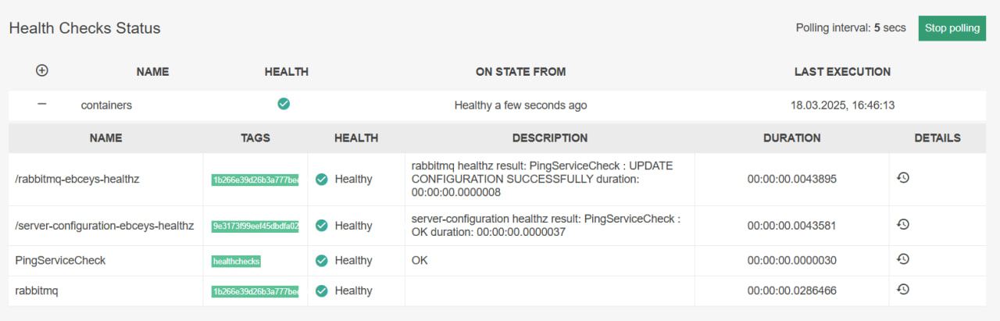

# Пример использования через *docker-compose*

## Подготовка образа через *Dockerfile*

Сам *Dockerfile* представлен [тут](./Dockerfile).

В данном примере сборка осуществляется на базе [образа *ubuntu*](https://hub.docker.com/_/ubuntu).

Из образа [*app-starter*](https://github.com/EBCEYS/EBCEYS.App-Starter) берется исполняемый файл, который будет входной точкой в контейнер.

Из образа *healthcheckerservice* берется исполняемый файл, который помечается в переменных окружения *APP_STARTER_EXECUTION_FILE=/app/EBCEYS.HealthChecksService* для запуска через *app-starter*.

В данном случае, для запуска сервиса проверок здоровья необходимо установить пакет *libicu-dev*.

## [*docker-compose.yaml*](./docker-compose.yaml)


### *server-configuration*

Настраивается сервис [*server-configuration:*](https://github.com/EBCEYS/EBCEYS.Server-Configuration).

В данном случае, для примера, добавлена проверка здоровья контейнера с *rabbitmq* (который тоже запускается через *app-starter*). Для этого в директории конфигурации сервера конфигурации необходимо добавить файл *HEALTHCHECKS_SERVICE_CONFIG_FILE=**/healthz/checks.json***.

Содержимое файла:
```json
{
	"healthChecks":
	{
		"RabbitMQ": // тип сервиса
		[
			{
				"serviceName":"rabbitmq", // имя проверки здоровья
				"container":"rabbitmq", // имя или ID контейнера
				"connectionString":"amqp://<<rabbitmq.username>>:<<rabbitmq.password>>@rabbitmq:5672/" // строка подключения к сервису
			}
		]
	}
}
```

*<<rabbitmq.\*>>* - ключи. Описание представлено [тут](https://github.com/EBCEYS/EBCEYS.Server-Configuration/blob/main/docs/Entities.md)

В лейблах необходимо указать:
* хост;
* порт;
* необходимость проверок здоровья;
* необходимость рестарта контейнера при статусе *unhealthy*;
* [опционально] наличие проверок здоровья из [библиотеки](https://github.com/EBCEYS/EBCEYS.ContainersEnvironment).

### *rabbitmq*

Контейнер с брокером сообщений [*rabbitmq*](https://www.rabbitmq.com).

Запускается через *app-starter*.

Пример приведен [тут](https://github.com/EBCEYS/EBCEYS.App-Starter/blob/main/docs/docker.md).

### *ebceys.healthchecks*

Контейнер с сервисом проверок здоровья.

Запускается через *app-starter*.

При запуске запрашивает конфигурацию и запускает сервис с проверкой здоровья *rabbitmq*.

**!!!ВАЖНО!!!** в данном случае необходимо указать *APP_STARTER_ENABLE_HEALTHCHECKS=false*, иначе будет конфликт портов.

Отображение в веб-интерфейсе:


1. Статус *app-starter-а* в контейнере *rabbitmq*.
1. Статус сервера конфигурации в контейнере *server-configuration*.
1. Статус здоровья сервиса проверок здоровья.
1. Статус сервиса *rabbitmq*, проверяемый по протоколу *amqp*.